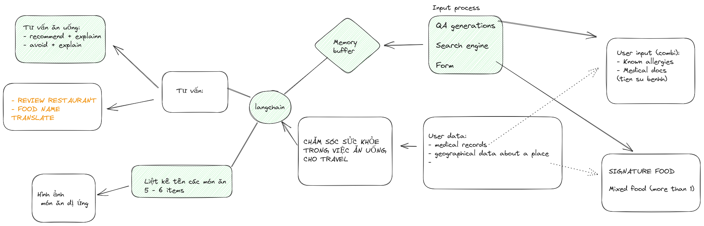

# Food Doctor for Travlers

Travelling means going out to new places and it can be very unfortunate if you happen to eat the wrong food.

We decided to build a project that leverages Google Palm 2 and Text-to-Image model to provide users with food knowledge to avoid allergies.

A safe journey is the best journey.

# How to run

You'll need a _service account JSON file_ provided by Google Cloud. And do the following cmd.
```bash
# At the parent directory
mkdir .google
cp <your_service_account>.json ./google/service_account.json
```

You'll aslo need a _env_ inside .google directory. The _env_ file contains:
```
LANGCHAIN=Langchain_plus_api_key
```

Install python packages.
```
pip install -r requirements.txt
```

# How we help users

Most people only know certain food that they are allergic to, but don't relize that the allergens are the real cause.
So we will based on this information to ask Palm 2 to determine what allergens causing the allergies.

You can look at how this process will be performed from the picture.


# Project overall process

The overall process of this project, from the start to the end.


